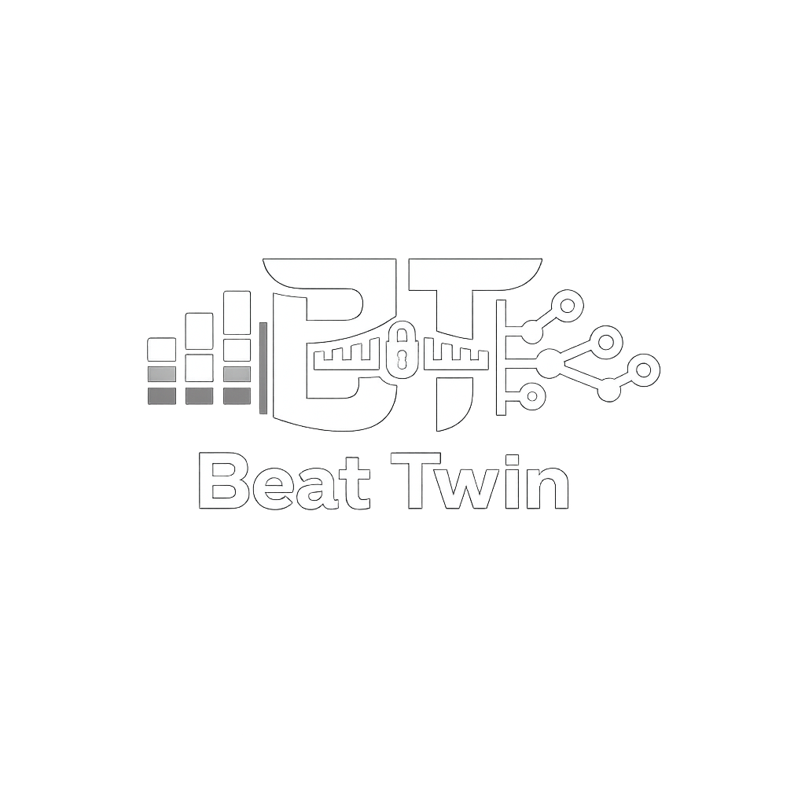

<p align="center">
  
</p>

# Beat Twin

Beat Twin is an experimental, local-first orchestration layer between musical agents and DAWs.

Its target architecture is:

```text
Local LLM
  -> Beat Twin
  -> selected DAW adapter
       -> Beat Twin Mini-DAW
       -> Bitwig Studio
       -> Ableton Live (later)
       -> Ardour (later)
```

The current repository contains two working musical surfaces:

- a Bitwig Studio MCP bridge with explicit write-policy gates;
- a standalone browser Mini-DAW Playground built on canonical Beat Twin song and command models.

The DAW-agnostic adapter and local-LLM gateway are documented and planned, but not implemented yet.

## What Works

### Canonical musical foundation

- Pure `Song`, `Track`, `Clip`, and `Note` model in `@beat-twin/core`.
- Typed `BeatTwinCommand` mutation boundary in `@beat-twin/commands`.
- Schema-versioned serialization and deterministic command tests.

### Browser Mini-DAW

- Command-first local song sketches.
- Tone.js and Web Audio audition.
- Note creation, editing, and removal.
- Clip duplication, quantization, and transposition.
- Keyboard shortcuts and command palette.
- Local undo/redo and JSON save/load.
- Timeline selection and note-density feedback.
- Deterministic command drafts.

The Mini-DAW is a standalone Beat Twin target. It is not a Bitwig preview and does not require Bitwig.

### Bitwig integration

- Read-only session inspection for transport, tracks, scenes, selected device, and remote controls.
- Plan-only arrangement suggestions based on the current Bitwig snapshot.
- Transport, mixer, clip, scene, device, and application write tools, hidden and blocked by default.
- A Bitwig controller script speaking JSON-RPC over local TCP.
- Offline protocol and policy tests.
- Manual live-test support for disposable Bitwig projects.

## Architecture

### Canonical browser path

```text
apps/playground
  -> @beat-twin/commands
  -> @beat-twin/core
  -> @beat-twin/audio-tone
  -> Web Audio output
  -> localStorage JSON save/load
```

Browser audition and editing are local Mini-DAW behavior. They do not call Bitwig or MCP.

### Current Bitwig compatibility path

```text
MCP client
  -> Node.js MCP server (index.js)
  -> local TCP JSON-RPC bridge on 127.0.0.1:8888
  -> Bitwig controller script
  -> Bitwig Studio
```

The root `index.js` remains the current MCP compatibility anchor. It connects to Bitwig through `BITWIG_HOST` and `BITWIG_PORT`.

### Planned DAW-agnostic path

```text
Local LLM client
  -> authenticated Beat Twin Agent Gateway
  -> SongPatch validation and preview
  -> canonical BeatTwinCommand[]
  -> selected DawAdapter
```

The model will not receive raw DAW protocol methods. Beat Twin will own capability negotiation, validation, confirmation, routing, and execution reporting. Adapters will own only target-specific inspection and canonical-command translation.

See:

- [ADR-001: Local LLM and DAW adapter boundary](docs/ADR-001-GEMMA-MOBILE-AGENT.md)
- [First dual-target vertical slice](docs/GEMMA-MOBILE-VERTICAL-SLICE.md)

## Requirements

- Node.js 20 or newer
- pnpm 11.10.0 or newer
- A modern browser for the Mini-DAW
- Bitwig Studio only for Bitwig integration and live verification

## Install

```bash
pnpm install
```

## Run The Mini-DAW

```bash
pnpm playground:dev
```

This runs the standalone browser Playground. It does not require Bitwig.

## Run The Current MCP Server

```bash
node index.js
```

Configure your MCP client to run that command from this repository. A portable example lives in [`llm-mcp/mcp.example.json`](llm-mcp/mcp.example.json).

Codex example:

```bash
codex mcp add beat-twin --env BITWIG_HOST=127.0.0.1 --env BITWIG_PORT=8888 -- node /absolute/path/to/beat-twin/index.js
```

## Install The Bitwig Controller

Copy the controller script into your Bitwig controller scripts directory.

Linux example:

```bash
mkdir -p "$HOME/Bitwig Studio/Controller Scripts/BeatTwin"
cp bitwig-controller/BeatTwin/BeatTwin.control.js "$HOME/Bitwig Studio/Controller Scripts/BeatTwin/BeatTwin.control.js"
```

macOS users commonly use:

```text
$HOME/Documents/Bitwig Studio/Controller Scripts/
```

Windows users can copy `bitwig-controller/BeatTwin` into:

```text
%USERPROFILE%\Documents\Bitwig Studio\Controller Scripts\
```

Then open Bitwig Studio and add the controller manually:

```text
Beat Twin -> Beat Twin
```

If Bitwig was already open before installing the file, restart Bitwig or reload
the controller settings before testing the bridge. See [`docs/LOCAL_MCP_SETUP.md`](docs/LOCAL_MCP_SETUP.md)
for local verification commands and troubleshooting.

## Safety Model

Beat Twin uses an inspect, propose, preview, confirm, then execute model.

The current MCP surface is read-only by default. Write tools are hidden and blocked unless the server starts with an explicit policy.

This gate is enforced by the Node MCP server only. The Bitwig controller TCP bridge is unauthenticated and executes JSON-RPC commands it receives. It must remain bound to loopback and must never be exposed directly to a phone, model, or untrusted network.

To enable a narrow write class:

```bash
BITWIG_MCP_WRITE_POLICY=transport node index.js
```

To enable multiple write classes:

```bash
BITWIG_MCP_WRITE_POLICY=transport,mixer_write node index.js
```

To enable every current Bitwig write class for disposable tests only:

```bash
BITWIG_MCP_ENABLE_WRITES=1 node index.js
```

Use Bitwig write mode only in a disposable project or a copy of real work.

The Mini-DAW currently remains browser-local. Future remote control through the Agent Gateway will require explicit connected-mode opt-in.

## Tests

Run the offline checks:

```bash
pnpm test
```

Run Mini-DAW checks:

```bash
pnpm --filter @beat-twin/playground test
pnpm --filter @beat-twin/playground build
```

Run a root MCP syntax check:

```bash
node --check index.js
```

Live Bitwig tests require Bitwig Studio, the controller script, explicit write permissions, and a disposable project.

## Useful Docs

- [`docs/ADR-001-GEMMA-MOBILE-AGENT.md`](docs/ADR-001-GEMMA-MOBILE-AGENT.md)
- [`docs/GEMMA-MOBILE-VERTICAL-SLICE.md`](docs/GEMMA-MOBILE-VERTICAL-SLICE.md)
- [`docs/PLAYGROUND_ARCHITECTURE.md`](docs/PLAYGROUND_ARCHITECTURE.md)
- [`docs/BT-101-SESSION-INSPECTOR.md`](docs/BT-101-SESSION-INSPECTOR.md)
- [`docs/BT-102-PROTOCOL-SMOKE.md`](docs/BT-102-PROTOCOL-SMOKE.md)
- [`docs/BT-103-POLICY-GATE.md`](docs/BT-103-POLICY-GATE.md)
- [`docs/BT-104-ARRANGEMENT-PLAN.md`](docs/BT-104-ARRANGEMENT-PLAN.md)
- [`docs/BITWIG_MANUAL_SMOKE_CHECKLIST.md`](docs/BITWIG_MANUAL_SMOKE_CHECKLIST.md)
- [`docs/AGENT_SETUP.md`](docs/AGENT_SETUP.md)
- [`docs/LOCAL_MCP_SETUP.md`](docs/LOCAL_MCP_SETUP.md)

## Status

Beat Twin is an experimental open-source foundation, not a hardened production tool.

Today, the Mini-DAW and Bitwig bridge are implemented as separate working surfaces sharing canonical musical concepts. The next phase is the DAW adapter contract and local-LLM orchestration path described in ADR-001.

## License

MIT
