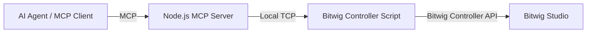

# Beat Twin

Beat Twin is a proof of concept that bridges [Bitwig Studio](https://www.bitwig.com/) with the [Model Context Protocol](https://modelcontextprotocol.io/).

It explores a concrete question: what does an AI-assisted music production loop look like when the agent can read and control a real Digital Audio Workstation instead of only generating static text or MIDI snippets?

> Status: personal R&D / proof of concept. The project is intentionally small, local-first, and focused on validating the MCP-to-DAW control path rather than shipping a polished product.

## Why this exists

Most AI music workflows stop at prompt-to-audio, prompt-to-MIDI, or assistant-style suggestions. Beat Twin takes a different path: expose a live DAW surface to an agent through explicit tools, permission boundaries, and a local transport layer.

The current goal is not to automate music creation end-to-end. The goal is to make the control loop observable, testable, and safe enough to experiment with agentic workflows inside Bitwig.

## Architecture

Beat Twin is split into two local components communicating over TCP:

1. **MCP server**
   - Node.js process exposing tools to an MCP-compatible client.
   - Receives tool calls from an AI assistant or agent runtime.
   - Relays commands to Bitwig through a local TCP bridge.

2. **Bitwig controller script**
   - JavaScript controller extension running inside Bitwig Studio.
   - Connects to the local bridge.
   - Executes selected Bitwig API operations.



## Implemented surface

### Transport

- `transport_play`
- `transport_stop`
- `transport_restart`
- `transport_record`
- `transport_get_tempo`
- `transport_set_tempo`
- `transport_get_position`
- `transport_set_position`

### Track and mixer

- `track_bank_get_status`
- `track_bank_set_volume`
- `track_bank_set_pan`
- `track_bank_set_mute`
- `track_bank_set_solo`
- `track_bank_select`
- `track_selected_get_status`
- `track_selected_set_volume`
- `track_selected_set_pan`
- `track_selected_set_mute`
- `track_selected_set_solo`
- `track_selected_set_arm`

## Safety model

This repository is built around explicit tool boundaries rather than broad DAW automation.

The current safety assumptions are:

- local-only transport;
- explicit MCP tools;
- write operations are intentionally narrow;
- future destructive actions should require a stronger permission layer.

This is still experimental software. Do not connect it to an untrusted agent runtime or expose the local bridge to a network.

## Requirements

- Node.js 16+
- Bitwig Studio
- An MCP-compatible client or agent runtime

## Installation

Install Node.js dependencies from the repository root:

```bash
npm install
```

Install the Bitwig controller script by symlinking or copying `bitwig-controller/BeatTwin` into your Bitwig Controller Scripts directory.

Common locations:

- Linux/macOS: `~/Documents/Bitwig Studio/Controller Scripts/`
- Windows: `%USERPROFILE%\Documents\Bitwig Studio\Controller Scripts\`

Example on Linux/macOS:

```bash
ln -s "$(pwd)/bitwig-controller/BeatTwin" "$HOME/Documents/Bitwig Studio/Controller Scripts/"
```

Then enable it in Bitwig:

1. Open Bitwig Studio.
2. Go to **Settings > Controllers**.
3. Choose **Add controller manually**.
4. Select **Beat Twin > Beat Twin**.
5. Start the MCP server and let the controller connect.

## Usage

Start the MCP server:

```bash
node index.js
```

Configure your MCP client to launch this command from the repository root.

Example prompts once connected:

```text
Start playback in Bitwig.
Set the tempo to 128 BPM.
Show me the current track bank status.
Mute track 2.
```

## Tests

Run the protocol smoke tests:

```bash
npm test
```

The current tests focus on the local protocol boundary: message framing, response parsing, timeouts, malformed responses, and reconnection behavior.

## Public-readiness notes

This repository is suitable as a small technical showcase, but it is still a proof of concept. The useful review areas are:

- MCP tool design;
- local protocol robustness;
- permission boundaries;
- Bitwig controller script structure;
- how far this pattern can reasonably go before it needs a stricter runtime model.

## Roadmap

- Add a clearer permission policy for write/destructive operations.
- Expand read-only device and clip inspection.
- Add more protocol and controller-script tests.
- Document a complete MCP client configuration example.

## License

MIT — see [LICENSE](./LICENSE).
