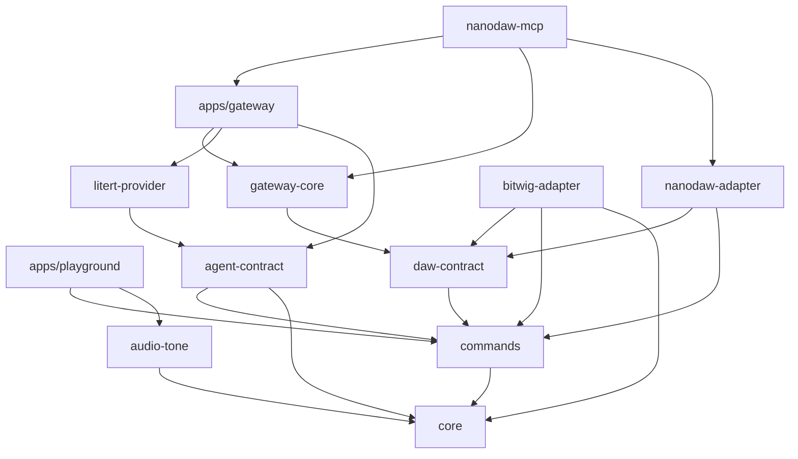
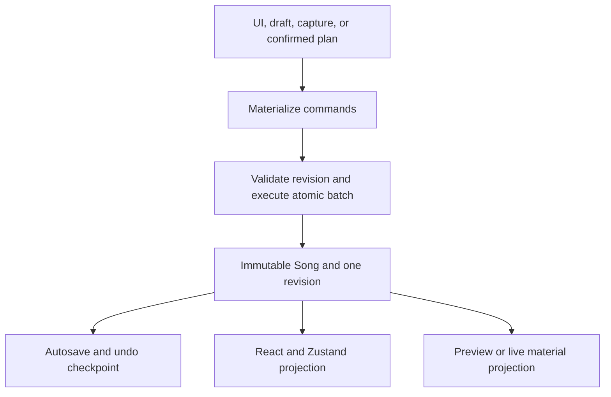
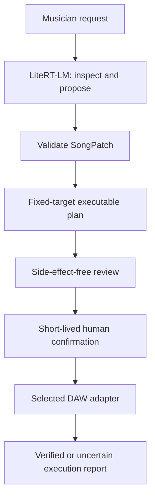
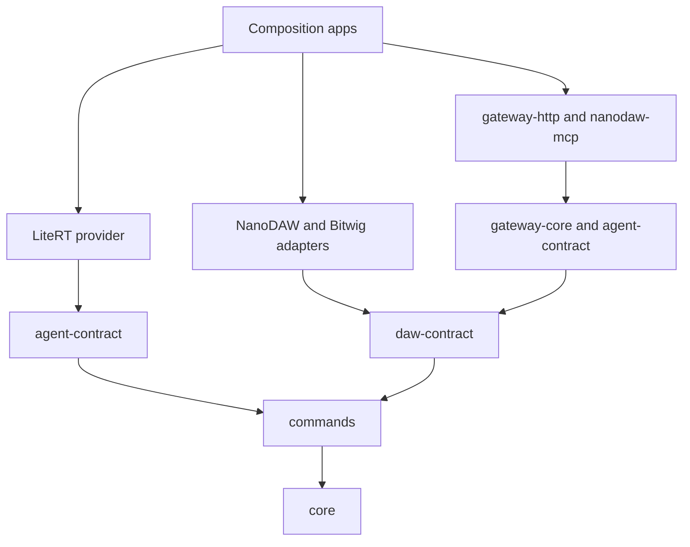

# Beat Twin Architecture Audit

Status: complete for GitHub #45

Baseline: `main` at `2ecd6cb7681c27ae04ba41519ec8ca50f9f1f282`

Date: 2026-07-20

Historical snapshot: this audit describes its stated `main` baseline. The
package-to-app, typed-delivery, composition-root, and retention findings are
addressed by the later #46, #47, #49, and #48 implementation; current restart
semantics are recorded in
[`ADR-003-PROCESS-LIFETIME-RETENTION.md`](ADR-003-PROCESS-LIFETIME-RETENTION.md).

## Executive Verdict

Beat Twin does not need a rewrite. Its behavioral architecture is stronger than
its physical architecture:

- one immutable, schema-versioned `Song` model;
- one canonical command language and atomic revision boundary;
- explicit browser ownership of NanoDAW state;
- strict model, plan, adapter, confirmation, and execution boundaries;
- honest partial/uncertain external-DAW outcomes;
- extensive deterministic tests around the highest-risk semantics.

The repository has grown through successful vertical slices, but several slices
landed inside large files or composition points that no longer match their
directory names. The highest-risk symptom is not file size by itself: it is that
`@beat-twin/nanodaw-mcp`, a reusable package, depends on the JavaScript
`@beat-twin/gateway` application and compiles against a handwritten ambient type
shim. That reverses the intended dependency direction and leaves the compiler
unable to validate the real Gateway contract.

The recommended direction is an evolutionary modular monolith:

1. preserve the current domain and safety contracts;
2. make applications explicit composition roots;
3. move typed delivery mechanisms into packages that applications compose;
4. enforce dependency direction in CI;
5. split internal hotspots by responsibility only after characterization tests
   protect their behavior;
6. define retention and restart semantics before packaging the Gateway as a
   long-lived process.

The migration is sequenced in
[`ARCHITECTURE_REFACTORING_ROADMAP_2026-07-20.md`](ARCHITECTURE_REFACTORING_ROADMAP_2026-07-20.md).
The package and composition-root decision is recorded in
[`ADR-002-MODULAR-MONOLITH-BOUNDARIES.md`](ADR-002-MODULAR-MONOLITH-BOUNDARIES.md).

## Scope And Method

The audit covered all 13 workspace manifests, 74 TypeScript/TSX/JavaScript
source files under `apps/` and `packages/`, the root Bitwig MCP server, the
Bitwig controller script, 38 test files, 42 Markdown documents, CI, package
build configuration, and the Orbit execution contract.

Evidence was collected from:

- package manifests and actual imports;
- public exports and composition entry points;
- state ownership and side-effect paths;
- runtime validators and failure semantics;
- test locations and the deterministic baseline;
- documentation claims compared with current code and merged history.

Baseline verification:

| Check | Result |
| --- | --- |
| `pnpm test` | 178 passed |
| `pnpm typecheck` | passed |
| `pnpm test:playground` | 15 files, 141 passed |
| Live Bitwig, controller, S25, and listening checks | not run; outside this audit |

Passing offline tests prove deterministic repository behavior only. They do not
prove a live Bitwig write, a live S25 provider request, audible quality, or
restart recovery.

## Current Architecture

### Working Surfaces

| Surface | Current composition point | State owner | External side effects |
| --- | --- | --- | --- |
| Historical Bitwig MCP | root `index.js` | Bitwig Studio | local TCP JSON-RPC through the controller |
| Standalone NanoDAW | `apps/playground` | browser `CommandState` | local storage and browser audio |
| Connected Agent mode | Playground plus Gateway HTTP/WebSocket | browser remains authoritative | loopback HTTP, WebSocket, LiteRT-LM |
| NanoDAW MCP planning | `packages/mcp/src/runtime.ts` | browser remains authoritative | MCP stdio plus loopback HTTP/WebSocket |
| Portable DAW execution | `DawAdapter` implementations | selected target | NanoDAW CAS batch or bounded Bitwig RPC |

### Package Dependency Graph

Arrows point from a consumer to what it depends on.

The graph is acyclic, but the final `nanodaw-mcp -> apps/gateway` edge is an
inversion: a package imports an application. The app currently acts both as a
delivery library and a potential process boundary.

### Canonical NanoDAW Mutation Flow

This is the repository's strongest boundary and should remain unchanged.

### Connected Agent Flow

Gemma has no confirmation or execution tool. The Gateway owns policy and plan
lifecycle, while adapters own target-specific inspection and execution.

### Historical Bitwig Compatibility Flow

The root `index.js` still owns the historical 57-tool registry, policy filtering,
MCP handlers, Bitwig diagnostics, JSON-RPC client, and arrangement planning. The
new `BitwigAdapter` is a separate portable execution path that receives an
injected RPC call. Both ultimately rely on the same controller protocol, but no
single typed package currently owns that shared transport contract.

## Strengths To Preserve

### S-01 — Explicit state ownership

`docs/product-constitution.md`, `apps/playground/src/store.ts`, and
`packages/adapters/nanodaw/src/index.ts` consistently keep the browser as the
only NanoDAW song owner. The WebSocket proxy transports inspection and one CAS
batch; it does not mirror a `Song`.

Evidence: `store.performance.test.ts`, `nanodaw-adapter.test.ts`,
`browser-nanodaw-websocket.test.js`, and `agentGateway.test.ts`.

### S-02 — Deterministic mutation language

`@beat-twin/commands` materializes IDs before execution, validates revisions,
executes a batch atomically, and binds idempotency to the exact request payload.
This is a reusable application boundary, not merely a UI helper.

Evidence: `packages/commands/test/commands.test.ts` and
`packages/agent-contract/test/agent-contract.test.ts`.

### S-03 — Fail-closed security and execution semantics

Pairing, quotas, immutable plans, exact confirmation, dynamic policy checks,
adapter preflight, no automatic retry after possible mutation, and redacted
audit events are explicit. Bitwig's non-atomic reality is reported as partial or
unknown rather than disguised as success.

Evidence: `gateway-core.test.ts`, `gateway.test.js`,
`bitwig-adapter.test.ts`, `policy-gate.test.js`, and
`bitwig-controller-security.test.js`.

### S-04 — Persistent document and live performance are separate truths

`CommandState` owns durable music; `PerformanceState` owns ephemeral IDs and
runtime facts; the audio engine must acknowledge scheduling and execution before
the UI claims an active clip. MIDI capture becomes durable only through one
ordinary command batch.

Evidence: `performanceRuntime.test.ts`, `liveAudioController.test.ts`,
`store.performance.test.ts`, and `midiRecording.test.ts`.

### S-05 — Tests protect semantics, not only implementation details

Adapter conformance, strict validation, protocol framing, compatibility
snapshots, stale revisions, uncertain outcomes, clock boundaries, and browser
ownership all have direct tests. This makes incremental extraction realistic.

## Findings

### Summary

| ID | Priority | Finding | Immediate action |
| --- | --- | --- | --- |
| A-01 | P0 | A package depends on an app through an unverified type shim | extract a typed Gateway transport package |
| A-02 | P0 | Composition roots are implicit and mixed with reusable delivery code | make `apps/*` wiring-only roots |
| A-03 | P1 | No CI rule protects package dependency direction | add a zero-runtime dependency guard |
| A-04 | P1 | Large mixed-responsibility files amplify change risk | split behind current public APIs, one hotspot at a time |
| A-05 | P1 | Historical and portable Bitwig paths can drift | extract shared transport/registry seams behind compatibility tests |
| A-06 | P1 | Runtime registries have no bounded retention or restart contract | define retention and storage ports before packaging |
| A-07 | P2 | DAW identities are hard-coded across several layers | add a fail-closed registry only when a third adapter starts |
| A-08 | P0 | Status, architecture docs, and open backlog contradict merged code | align current claims in this audit PR |
| A-09 | P2 | Build order and type resolution are manually encoded | move toward project references or graph-driven builds |

### A-01 — Package-to-application dependency and type hole

Evidence:

- `packages/mcp/package.json` depends on `@beat-twin/gateway`;
- `packages/mcp/src/runtime.ts` imports Gateway HTTP and WebSocket functions;
- `apps/gateway` is JavaScript and publishes no TypeScript declarations;
- `packages/mcp/src/gateway.d.ts` recreates only part of the API and types the
  request-handler options as `unknown`;
- `packages/mcp/tsconfig.build.json` has no typed path for the Gateway app.

Impact:

- changes to real Gateway options can compile while breaking MCP runtime wiring;
- a reusable package decides process composition;
- the directory graph does not communicate the runtime graph;
- future Gateway packaging has no clean application entry point.

Recommendation:

- create a typed `@beat-twin/gateway-http` delivery package for the HTTP handler
  and browser WebSocket transport;
- keep `@beat-twin/nanodaw-mcp` limited to its MCP service and transport;
- add `apps/nanodaw-mcp` and `apps/gateway` as wiring-only composition roots;
- remove the ambient `gateway.d.ts` after consumers compile against real types.

### A-02 — Implicit composition roots

Evidence:

- `apps/gateway/src/index.js` is imported as a library but does not itself wire a
  runnable Gateway process;
- `packages/mcp/src/runtime.ts` creates HTTP, WebSocket, adapter, plan store,
  pairing authority, and MCP stdio in a package;
- root `index.js` is simultaneously binary, MCP delivery adapter, tool registry,
  policy gate, diagnostic service, and Bitwig RPC client.

Impact: ownership of lifecycle, configuration, and shutdown is distributed
across files named as reusable libraries. This raises packaging and operational
risk even though unit tests pass.

Recommendation: applications wire dependencies and own lifecycle; packages
implement domain, application, port, adapter, or delivery capabilities but do
not instantiate unrelated sibling capabilities.

### A-03 — Dependency direction is convention-only

The current graph is encoded manually in `package.json`, `build:packages`, and
multiple `tsconfig.build.json` path maps. CI verifies that today's graph builds,
but it does not reject a new forbidden edge or explain the intended layers.

Recommendation: add a small repository test that reads workspace manifests and
asserts:

- no `packages/*` dependency may target `apps/*`;
- domain packages may not import delivery or adapter packages;
- composition apps may depend on packages, never the reverse;
- the workspace graph remains acyclic;
- every internal runtime import has a matching manifest dependency.

### A-04 — Mixed-responsibility hotspots

The following sizes are a snapshot, not an automatic quality threshold:

| File | Lines | Responsibilities currently combined |
| --- | ---: | --- |
| `apps/playground/src/App.tsx` | 1,503 | app composition, shortcuts, timeline, inspector, editor, command UI |
| `apps/playground/src/performanceRuntime.ts` | 1,508 | contracts, reducer, scene transactions, validation, reconciliation |
| `apps/playground/src/store.ts` | 1,390 | document runtime, history, persistence, parser, UI actions, performance sync |
| `apps/playground/src/liveAudioController.ts` | 1,017 | orchestration, observation, cancellation, material projection, fail-safe recovery |
| root `index.js` | 1,537 | RPC, diagnostics, plan helper, 57 tools, policy and MCP server |
| `packages/commands/src/index.ts` | 1,054 | command schema, materialization, execution, runtime cache, helpers |
| `bitwig-adapter/src/index.ts` | 961 | port, preflight, dispatch, polling, readback and reporting |

These files are generally cohesive at the product-boundary level and heavily
tested. Splitting them all at once would increase risk. The problem is that
unrelated changes often touch the same file and public API barrels contain the
implementation itself.

Recommendation: retain package entry points and move one responsibility at a
time to internal modules. Characterization tests must pass before and after
each move. Do not invent shared abstractions merely to reduce line counts.

### A-05 — Incomplete Bitwig strangler boundary

The historical MCP surface and portable `BitwigAdapter` intentionally coexist.
That is the correct migration strategy, but shared protocol concepts live in
three places:

- root `BitwigProtocolClient` and authentication call options;
- `BitwigBridgePort` / `createRpcBitwigBridgePort` in the adapter;
- the single-file Bitwig controller protocol implementation.

The compatibility snapshot protects 57 MCP tools, and protocol tests protect
authentication, but future controller changes still require coordinated edits
across large files.

Recommendation: first extract the root RPC client, tool registry, and policy
handler behind the unchanged `index.js` exports. Only then consider generating
the required single controller file from modular sources, and only with a live
disposable-project gate.

### A-06 — Unbounded process-lifetime state and ambiguous durability

Evidence:

- `createCommandRuntime()` retains every completed request ID;
- both DAW adapters retain request executions, and the Bitwig adapter retains
  inspection observations;
- `PairingAuthority` and `GatewayPlanStore` retain pairings, plans,
  confirmations, and terminal outcomes in memory;
- `PerformanceState.transitionIds` deliberately reserves IDs until reset.

The maps are correct for current exactly-once semantics, but no eviction,
capacity, persistence, or restart contract exists. Gateway execution status is
readable after an uncertain outcome only for the current process lifetime; it
is not crash-durable storage.

Recommendation: document bounded retention first, then introduce clock-aware
cleanup and a storage port for any state that must survive a process restart.
Keep idempotency evidence long enough to preserve safety; never evict merely to
reduce memory without defining replay consequences.

### A-07 — Closed DAW identity is spread across layers

`DawAdapterId`, LiteRT tool arguments, Gateway route validation, adapter maps,
and capability validation explicitly enumerate NanoDAW and Bitwig. This is safe
for two targets but means a future Ableton or Ardour adapter changes domain,
provider, HTTP, and composition code together.

Recommendation: do not generalize now. When a third adapter is activated,
introduce a composition-owned, fail-closed adapter registry and derive public
target lists and validation from registered descriptors. Unknown IDs must still
be rejected before model invocation or mutation.

### A-08 — Documentation and backlog drift

Before this audit, the README, `STATUS.md`, `PROJECT_SUMMARY.md`,
`ROADMAP.md`, `PLAYGROUND_ARCHITECTURE.md`, and `packages/adapters/README.md`
described the browser WebSocket proxy or Bitwig adapter as future work even
though their code and deterministic tests are merged. Conversely, a number of
GitHub issues for merged slices remain open.

Impact: stale claims are especially risky in a security-sensitive project
because they obscure which gates exist in code and which live evidence remains
missing.

Recommendation: distinguish three states consistently:

1. implemented and covered deterministically;
2. wired into a runnable local composition;
3. proven against a live external system.

This PR aligns repository documentation. GitHub issue-state reconciliation
should be handled separately so no issue is closed without checking its exact
acceptance criteria.

### A-09 — Manual build graph and split resolution modes

Package builds consume generated `dist` declarations in a manually ordered root
script. The Playground compiles selected packages directly from source via Vite
path aliases. Both modes pass today, but adding or reordering packages requires
several synchronized edits and may expose different import-resolution behavior.

Recommendation: after dependency rules are enforced, evaluate TypeScript
project references or a graph-aware workspace build. Preserve package smoke
tests and do not adopt a task runner until the repository has a measured need.

## Target Architecture

### Dependency Rules

1. `core` owns the versioned musical document and pure operations.
2. `commands` is the only canonical durable NanoDAW mutation language.
3. contracts depend inward on domain types; domain packages never depend on
   adapters, delivery mechanisms, applications, or UI.
4. adapters implement ports and depend on contracts, never on applications.
5. delivery packages translate HTTP, WebSocket, MCP, or UI events into
   application calls without owning domain state.
6. `apps/*` are the only composition roots. They own configuration, dependency
   construction, process lifecycle, and shutdown.
7. no package may depend on an app.
8. historical compatibility entry points remain thin facades until explicitly
   retired.

### Target Package Shape

Proposed composition roots:

| App | Owns |
| --- | --- |
| `apps/playground` | browser UI, browser-owned state, audio lifecycle |
| `apps/gateway` | provider, adapter registry, pairing/plan stores, HTTP/WS lifecycle |
| `apps/nanodaw-mcp` | MCP stdio, NanoDAW review route, Gateway transport composition |
| root `index.js` | temporary compatibility facade for historical Bitwig MCP |

Proposed reusable delivery package:

| Package | Owns | Must not own |
| --- | --- | --- |
| `packages/gateway-http` | typed request handler, loopback/CORS/body policy, browser WebSocket transport | provider construction, adapter construction, process startup |
| `packages/mcp` | MCP schemas, service, server transport adapter | Gateway process composition, browser state |

### Internal Module Boundaries

Large packages should keep one stable public `index.ts` while internal modules
move behind it. Suggested seams:

- `commands`: contract, materialization, execution, runtime/idempotency;
- `gateway-core`: pairing, plans, confirmations/execution, scopes, audit;
- `agent-contract`: versioned schemas, validation, compilation, preview;
- `daw-contract`: public types, validators, conformance utilities;
- Playground: document runtime, persistence/history, deterministic draft parser,
  performance reducer, audio orchestration, feature UI;
- historical Bitwig MCP: protocol client, diagnostics, tool registry, policy,
  MCP delivery facade.

The goal is explicit ownership and smaller change surfaces, not maximal file
count.

## Migration Principles

- preserve behavior before moving code;
- one independently reviewable boundary per PR;
- no package rename and behavior change in the same slice;
- no second `Song` owner, shadow command bus, or generic agent mutation API;
- no weakened validation to make interfaces easier to share;
- no automatic retry after an external target may have mutated;
- retain the root binary and 57-tool snapshot throughout Bitwig extraction;
- treat live verification and listening as separate human gates;
- remove compatibility shims only after every caller compiles against the real
  replacement contract.

## First High-Value Slices

1. Add a dependency-direction test and document the allowed graph. This is
   low-risk and prevents the current inversion from spreading.
2. Extract typed Gateway HTTP/WebSocket delivery and move runtime wiring into
   explicit apps. This removes the largest type and composition hole without
   changing endpoint behavior.
3. Define request, plan, confirmation, pairing, observation, and transition-ID
   retention/restart semantics before long-lived packaging.

The complete sequence, dependencies, test gates, and rollback boundaries are in
the refactoring roadmap.

## Non-Goals

- rewriting Beat Twin or NanoDAW;
- merging all packages into one package;
- splitting the repository into network services;
- replacing TypeScript, React, Zustand, Tone.js, MCP, or the controller protocol;
- changing `Song`, command, SongPatch, adapter, or Gateway behavior in the audit;
- adding a third DAW adapter;
- performing a live Bitwig write;
- closing historical issues without validating their acceptance criteria.

## Issue #45 Acceptance Evidence

- [x] Current package ownership and dependency direction are documented.
- [x] NanoDAW, Agent, and historical Bitwig runtime flows are documented.
- [x] Architectural risks cite concrete source and test locations.
- [x] A target architecture and its trade-offs are proposed.
- [x] The migration is split into independently reviewable slices.
- [x] The first low-risk, high-value slices are identified.
- [x] Safety, determinism, local-first ownership, and live-evidence boundaries
      are explicit.
- [x] The audit, ADR, and roadmap are repository documents linked from the docs
      index.
